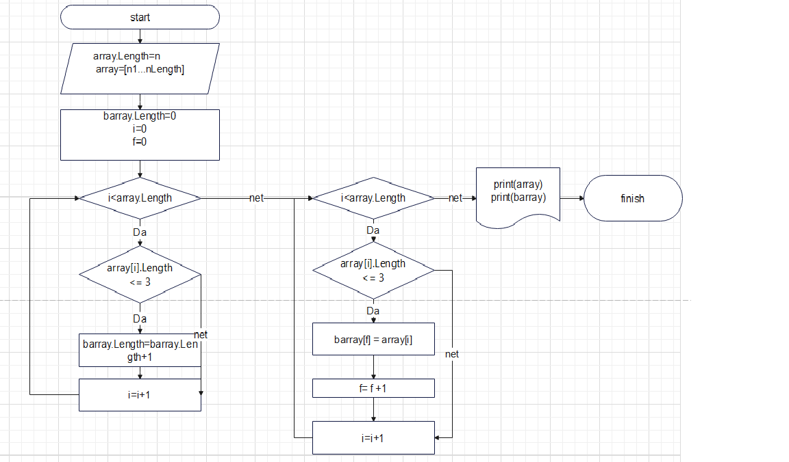

# **Итоговая контрольная работа по основному блоку**
## **Задача:** Написать программу, которая из имеющегося массива строк формирует новый массив из строк, длина которых меньше, либо равна 3 символам. Первоначальный массив можно ввести с клавиатуры, либо задать на старте выполнения алгоритма

### **Текстовое описание решения**

1. Для того чтобы сформировать новый массив намнужно узнать его длинну. Для этого первым нашим действием будет:

      1.1  Поиск количества элементов массива длинна которых <= 3.
      * Пройдемся по каждому элементу заданного массива  
      * Сравним его длинну элемента массива с заданным условием (<=3)
      * Количество элементов удовлетворяющих условию и будет длинной нового массива

2. Сформируем новый массив. Для этого:
    
    * Пройдемся по каждому элементу заданного массива  
    * Сравним его длинну элемента массива с заданным условием (<=3)
    * Если эллемент подходит под заданное условие то онстановитьсяэлеменом нового массива 
    * Если нет пропускаем его 

## Блок схема
